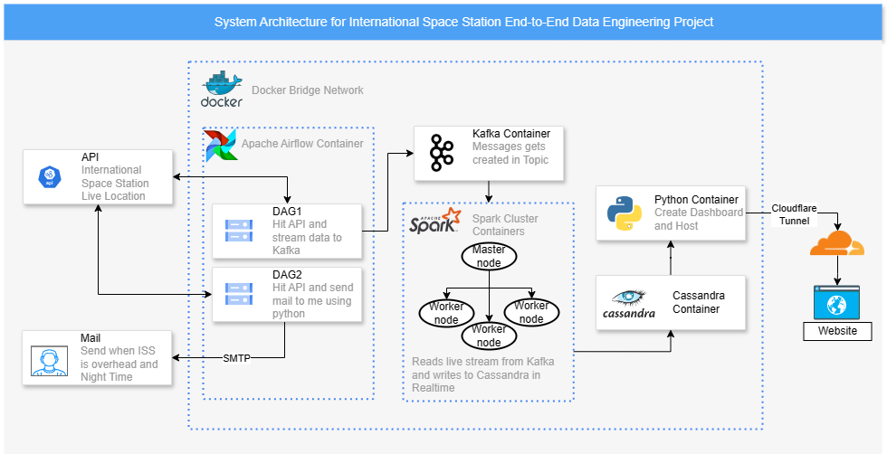

# International Space Station Data Engineering Live Streaming Project

This project aims to create a robust data engineering pipeline using technologies such as Apache Airflow, Apache Kafka, Apache Zookeeper, Apache Spark, Cassandra, Python, and Docker.

## Overview

The project involves fetching real-time data from the ISS API, streaming it to Kafka, and then using Spark to insert this data into Cassandra. Additionally, a mechanism will be implemented to receive an email notification when the ISS is overhead at the current location during nighttime, allowing for the observation of the fastest-moving object in the sky.

## Dashboard

A dashboard will be created to visualize the ISS's longitude and latitude on a world map, with the ability to filter by date.

[Link to final dashboard](https://isspydash.prabshhs.in)

## Architecture Flowchart



## Docker Containers and Configuration

To set up the data pipeline, an environment hosting all the required services will be created. One approach is to create a Docker bridge network and run containers for all these services within this network.

### Airflow container

[Link to Docker compose file](Containers/Airflow/docker-compose.yml)

### Add mail and password to envronment variable in airflow webserver and scheduler

<!-- this was a temprory solution, so added diretly to docker-compose file of airflow scheduler and webserver-->
<!-- docker exec -it airflow-scheduler-1 bash
docker exec -it airflow-webserver-1 bash
```bash

export GMAIL_EMAIL=your_email@gmail.com
export GMAIL_PASSWORD=your_password

env
```
 -->

add following in airflow webserve and scheduler docker-compose.yml file - 
```yml
services:
  webserver:
    environment:
      - GMAIL_EMAIL=your_email@gmail.com
      - GMAIL_PASSWORD=your_password
```
